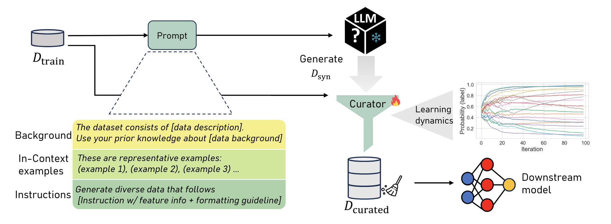

# Curated LLM: Synergy of LLMs and Data Curation for tabular augmentation in low-data regimes

[](https://arxiv.org/abs/2312.12112)
[](https://github.com/seedatnabeel/CLLM/blob/main/LICENSE)




Note: Repository still under construction...

This repository contains the implementation of CLLM from the paper "Curated LLM: Synergy of LLMs and Data Curation for tabular augmentation in low-data regimes".

🔎 CLLM is a synthetic data generation framework using LLMs for synthetic generation, coupled with a principled data-centric curation mechanism --- ensuring high quality data!

CLLM supports LLMs deployed Azure OpenAI, Together or VLLM 🥳

For more details, please read our [paper](https://arxiv.org/abs/2312.12112): *Curated LLM: Synergy of LLMs and Data Curation for tabular augmentation in low-data regimes*.

## Installation
1. Clone the repository
2. (a) Create a new virtual environment with Python 3.10. e.g:
```shell
    virtualenv cllm_env
```

3. (b) Create a new conda environment with Python 3.10. e.g:
```shell
    conda create -n cllm_env python=3.10
```

3. With the venv or conda env activated, run the following command from the repository directory:

- Install the minimum requirements to run CLLM
 ```shell
pip install -r requirements.txt
 ```

4. Link the environment to the kernel:
  ```shell
 python -m ipykernel install --user --name=cllm_env
 ```


## Getting started with CLLM


To get started with CLLM one can try the ``tutorial.ipynb`` notebook in the root folder. One can generate synthetic data using LLM served via OpenAI, Together or VLLM.

### Generation
To run generation of multiple datasets see ``run_llm_generator.ipynb``


### Insights Notebooks
To run the insights experiments one can run any of the Jupyter notebooks (.ipynb) found in the ``notebooks`` folder


## Citing

If you use this code, please cite the associated paper:

```
@inproceedings{
cllm2024,
title={Curated {LLM}: Synergy of {LLM}s and Data Curation for tabular augmentation in low-data regimes},
author={Nabeel Seedat and Nicolas Huynh and Boris van Breugel and Mihaela van der Schaar},
booktitle={Forty-first International Conference on Machine Learning},
year={2024},
}

```
